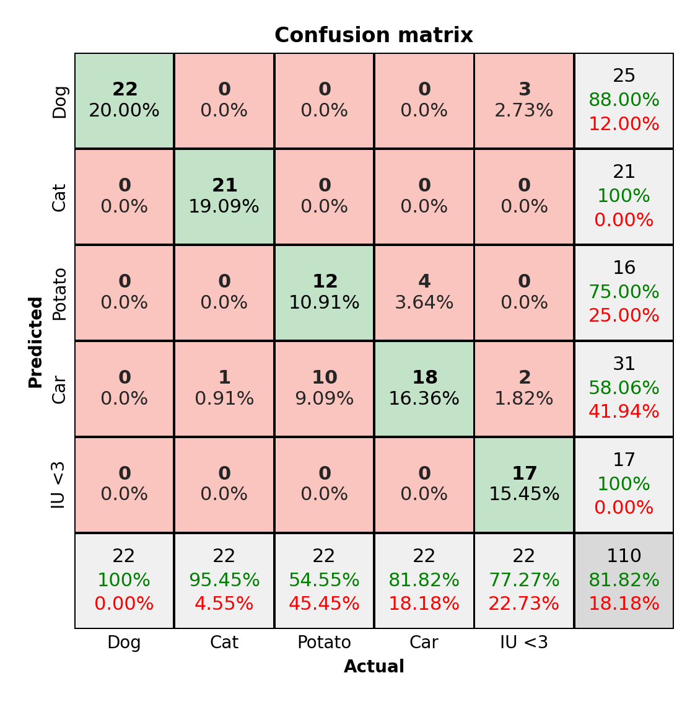

# Pretty Confusion Matrix for Python
The Pretty Confusion Matrix in MATLAB style for python, using seaborn and matplotlib.

This repository was forked and modified from [Wagner's Pretty print confusion matrix](https://github.com/wcipriano/pretty-print-confusion-matrix).

---
**Example**:


## Installation
- Clone this repository:
   ```bash
   git clone https://github.com/phongsathorn1/pretty-confusion-matrix.git
   ```
- Install required packages:
   ```bash
   pip install -r requirements.txt
   ```

## Usage

- **Plot from numpy `y_predict` and `y_actual` vectors**
   ```python
   from pretty_cm import plot_from_data

   y_actual = np.array([1,2,3,4,5, 1,2,3,4,5, ...])
   y_predict = np.array([1,2,4,3,5, 1,2,3,4,4, ...])

   plot_from_data(y_actual, y_predict)
   ```

- **Plot from numpy confusion matrix**
   ```python
   from pretty_cm import plot_from_confusion_matrix

   cm = np.array([[13,  0,  1,  0,  2,  0],
                  [ 0, 50,  2,  0, 10,  0],
                  [ 0, 13, 16,  0,  0,  3],
                  [ 0,  0,  0, 13,  1,  0],
                  [ 0, 40,  0,  1, 15,  0],
                  [ 0,  0,  0,  0,  0, 20]])

   plot_from_confusion_matrix(cm)
   ```

- **Plot with custom labels**
   ```python
   plot_from_data(y_test, predic, 
                  columns=["Dog", "Cat", "Potato", "Car", "IU <3"])

   # -- or --

   plot_from_confusion_matrix(cm, columns=["Dog", "Cat", "Potato", "Car", "IU <3"])
   ```

   Result:

   

- **Change figure size**
   ```python
   plot_from_data(y_test, predic, figsize=[6,6])

   # -- or --

   plot_from_confusion_matrix(cm, figsize=[6,6])
   ```

## Licensing
The Pretty Confusion Matrix is licensed under Apache License, Version 2.0. see [License](LICENSE) for full license text.

## References:
1. MATLAB confusion matrix

   - https://www.mathworks.com/help/nnet/ref/plotconfusion.html
   
   - https://www.mathworks.com/help/examples/nnet/win64/PlotConfusionMatrixUsingCategoricalLabelsExample_02.png
