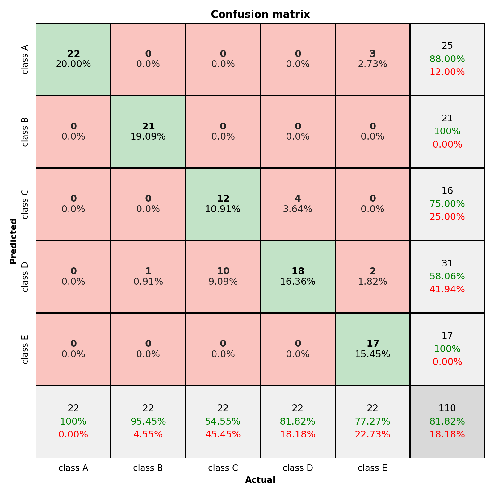

# Pretty Confusion Matrix for Python
The Pretty Confusion Matrix in MatLab style for python, using seaborn and matplotlib.

This repository was forked and rewrite from [Wagner's Pretty print confusion matrix](https://github.com/wcipriano/pretty-print-confusion-matrix).


**Examples**:


## Quickstart
This module get a pretty print confusion matrix from a np matrix or from a y_test and predition values

- **Plot from numpy `x` and `y` vectors**
```python
from pretty_cm import plot_from_data

y_test = np.array([1,2,3,4,5, 1,2,3,4,5, ...])
predic = np.array([1,2,4,3,5, 1,2,3,4,4, ...])

plot_from_data(y_test, predic)
```

- **Plot from numpy confusion matrix**
```python
from pretty_cm import plot_from_confusion_matrix

cm = np.array([[13,  0,  1,  0,  2,  0],
               [ 0, 50,  2,  0, 10,  0],
               [ 0, 13, 16,  0,  0,  3],
               [ 0,  0,  0, 13,  1,  0],
               [ 0, 40,  0,  1, 15,  0],
               [ 0,  0,  0,  0,  0, 20]])

plot_from_confusion_matrix(cm)
```


## References:
1. MatLab confusion matrix

   - https://www.mathworks.com/help/nnet/ref/plotconfusion.html
   
   - https://www.mathworks.com/help/examples/nnet/win64/PlotConfusionMatrixUsingCategoricalLabelsExample_02.png